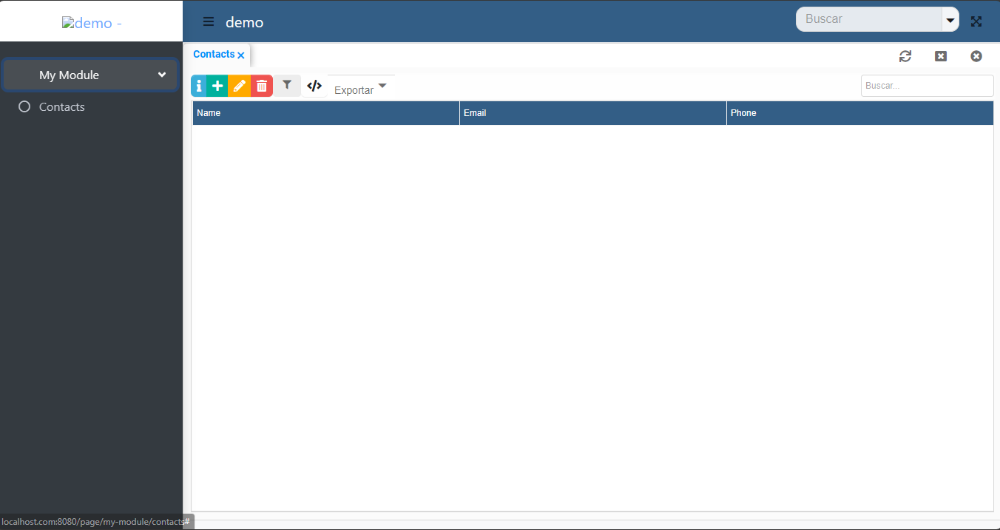
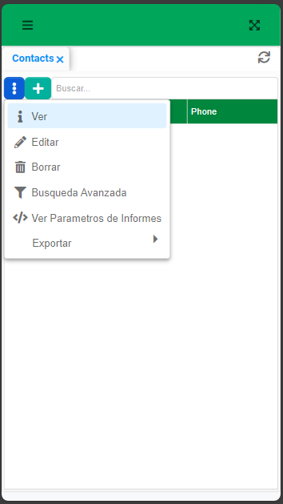

import {Aside} from '@astrojs/starlight/components';

## Instalación

1. Crea un nuevo proyecto SpringBoot usando https://start.spring.io y selecciona Web, JPA y un lenguaje de programación para tu app Spring Boot.
DynamiaTools es compatible con Java, Groovy y Kotlin

<Aside>Puedes [hacer clic
aquí](https://start.spring.io/#!type=maven-project&language=java&packaging=jar&jvmVersion=21&groupId=com.example&artifactId=dynamia-tools-project&name=Dynaima&description=Demo%20project%20for%20Spring%20Boot&packageName=com.example.demo&dependencies=web,data-jpa,h2)
para obtener un proyecto Spring Boot preconfigurado con Java, Maven y soporte para Web y JPA.</Aside>

2. Descárgalo e impórtalo en tu IDE
3. Agrega la dependencia starter de DynamiaTools.

**Maven**

```xml
<!--pom.xml-->
<dependencies>
    <dependency>
        <groupId>tools.dynamia</groupId>
        <artifactId>dynamia-tools-starter</artifactId>
        <version>LAST_VERSION</version>
    </dependency>
</dependencies>
```

**Gradle**
```groovy
//build.gradle
compile 'tools.dynamia:dynamia-tools-starter:LAST_VERSION'
```

Ve a [Maven Central](https://central.sonatype.com/artifact/tools.dynamia/tools.dynamia.app) para verificar la última versión.

Este starter habilita DynamiaTools en tu aplicación y agrega soporte para ZK, JPA y vistas y rutas personalizadas.

4. Ejecuta y listo

```java
//MyApplication.java

package demo;

import org.springframework.boot.SpringApplication;
import org.springframework.boot.autoconfigure.SpringBootApplication;

@SpringBootApplication
class MyApplication {

    public static void main(String[] args) {
        SpringApplication.run(MyApplication.class, args);
    }

}
```

Después de ejecutar la aplicación, abre tu navegador y ve a http://localhost:8080. Deberías ver una página en blanco con una
plantilla HTML completamente funcional llamada Dynamical. Más adelante personalizaremos esta página


## Primer proyecto

Vamos a crear algo útil, como un CRUD de contactos para almacenar nuestra lista de contactos. Para crear un CRUD en Dynamia Tools, sigue estos 3 pasos:


1. Crea una entidad JPA
2. Crea un módulo Dynamia
3. Define un descriptor de vista para las vistas **form** y **table**

### 1. Crear una entidad JPA

Vamos a crear una nueva clase llamada `Contact` y anotarla con `@Entity` para crear una entidad JPA. Agrega los campos nombre, email y
teléfono.

```java
//Contact.java
package demo;

import jakarta.persistence.Entity;
import jakarta.persistence.Table;
import jakarta.persistence.Id;
import jakarta.validation.constraints.NotNull;

import jakarta.persistence.*;
import jakarta.validation.constraints.Email;
import jakarta.validation.constraints.NotEmpty;

@Entity
@Table(name="contacts")
public class Contact {

    @Id
    @GeneratedValue(strategy = GenerationType.AUTO)
    private Long id;

    @NotEmpty
    private String name;
    @Email
    private String email;

    private String phone;

    public Long getId() {
        return id;
    }

    public void setId(Long id) {
        this.id = id;
    }

    public String getName() {
        return name;
    }

    public void setName(String name) {
        this.name = name;
    }

    public String getEmail() {
        return email;
    }

    public void setEmail(String email) {
        this.email = email;
    }

    public String getPhone() {
        return phone;
    }

    public void setPhone(String phone) {
        this.phone = phone;
    }

    @Override
    public String toString() {
        return name;
    }
}
```

Esta es una clase POJO simple anotada con las anotaciones estándar de JPA. Ten en cuenta que también puedes usar anotaciones de validación


## 2. Módulos en DynamiaTools

Los módulos DynamiaTools son componentes estándar de Spring que implementan la interfaz `tools.dynamia.navigation.ModuleProvider`
y devuelven un nuevo objeto `tools.dynamia.navigation.Module`. Piensa en los módulos Dynamia como enrutadores que definen la navegación para las páginas.


```java
//ContactModuleProvider.java
package demo;

import org.springframework.stereotype.Component;
import tools.dynamia.crud.CrudPage;
import tools.dynamia.navigation.Module;
import tools.dynamia.navigation.ModuleProvider;

@Component
public class ContactModuleProvider implements ModuleProvider {

    @Override
    public Module getModule() {

        Module myModule = new Module("my-module", "My Module");
        myModule.addPage(new CrudPage("contacts", "Contacts", Contact.class));

        return myModule;
    }
}
```
Un `Module` incluye un ID, nombre, páginas y grupos de páginas. Por otro lado, las `Pages` incluyen ID, nombre y ruta, que
en este caso está representada por una clase de entidad. Los `IDs` son cruciales porque definen la ruta para tus páginas. Por ejemplo,
la página CRUD de `Contact` tiene la ruta `/pages/my-module/contacts`.

## 3. View Descriptors

Los descriptores de vista definen cómo se renderizarán las vistas para las entidades en tiempo de ejecución. Por defecto, DynamiaTools renderiza vistas para
formularios, tablas, árboles, configuraciones y otros. En las guías avanzadas aprenderás a personalizar los renderizadores de vista e implementar
tus propios tipos de vistas.

Los descriptores son archivos `YML` con campos y parámetros para clases de entidad. Creamos una carpeta para ellos en `/resources/META-INF/descriptors` y creamos el archivo `ContactForm.yml`. El nombre del archivo no es especial, pero por una buena práctica, nómbralo usando el nombre de la entidad y el tipo de vista.

```yaml
# /resources/META-INF/descriptors/ContactForm.yml
view: form # required
beanClass: demo.Contact # use fully qualified class name

fields:
  name:
    params: # customize component and layout
      span: 3
  email:
    params:
      type: email # setup type attribute of ZK textbox component
  phone:
    component: textbox #optional because string field are renderer link Textbox


#optional
layout:
  columns: 3

```

Ahora crea un descriptor de vista para la vista de tabla `ContactTable.yml`

```yaml
# /resources/META-INF/descriptors/ContactTable.yml
view: table
beanClass: demo.Contact # use fully qualified class name

#all field are rendered like Labels because view type is table
fields:
  name:
  email:
  phone:
```

### 4. Ejecuta y disfruta

Ahora tu aplicación tiene un nuevo menú llamado Mi Módulo y un submenú llamado Contactos. Este es un CRUD completamente funcional con crear,
leer, actualizar, eliminar y muchas más acciones listas para usar.

#### Vista de tabla


#### Vista de formulario


<Aside>No te preocupes por las etiquetas en Spanglish en los títulos y acciones, DynamiaTools y ZK tienen etiquetas localizadas, y mi navegador está configurado en español.</Aside>

### Personaliza tu primer proyecto

Usa los archivos estándar de Spring Boot `application.properties` o `application.yml` para personalizar la configuración global de los proyectos de dynamia tools.
Usa el grupo de propiedades `dynamia.app` para dynamia tools.

```yaml
#application.yml
dynamia:
  app:
    name: My First Project
    short-name: MFP
    default-skin: Green
    default-logo: /static/logo.png
    default-icon: /static/icon.png # used when navigation bar is collapsed
    url: https://www.dynamia.tools

#other spring boot settings

```

Vuelve a ejecutar tu aplicación y esta vez será una aplicación hermosa


**Responsivo**



**Dynamical** es una plantilla gratuita de Bootstrap 5 totalmente responsiva, consulta https://github.com/dynamiatools/theme-dynamical para obtener documentación


### REST automático

Acabas de construir un proyecto de pila completa con DynamiaTools en unos **10-15** minutos. Tu proyecto incluye algunas características especiales,
una de las cuales es un endpoint RESTful automático para todos los `CrudPages`. Crea algunos contactos en el front end, luego reemplaza la URL del navegador
con http://localhost:8080/api/my-module/contacts.

Deberías ver una respuesta JSON con tus contactos. En mi caso, recibí la siguiente respuesta:

```json
//http://localhost.com:8080/api/my-module/contacts
{
  "data" : [ {
    "id" : 1,
    "name" : "Peter Parker",
    "email" : "spidy@gmail.com",
    "phone" : "5556565656"
  }, {
    "id" : 2,
    "name" : "Dr Doom",
    "email" : "doomed@gmail.com",
    "phone" : "555-6999-666"
  }, {
    "id" : 3,
    "name" : "Tony Iron Stark",
    "email" : "ceo@starksindustry.com",
    "phone" : "5551656565"
  } ],
  "pageable" : {
    "totalSize" : 3,
    "pageSize" : 50,
    "firstResult" : 0,
    "page" : 1,
    "pagesNumber" : 1
  },
  "response" : "OK"
}
```

Luego navega a http://localhost.com:8080/api/my-module/contacts/1 y obtén la información del contacto con ID = 1

```json
{
    "data": {
        "id": 1,
        "name": "Peter Parker",
        "email": "spidy@gmail.com",
        "phone": "5556565656"
    },
    "response": "OK"
}
```

Verifica que el formulario json predeterminado de DynamiaTool tenga este formato:

```json
{
  "data": [],
  "response": "",
  "pageable": {}
}
```


## Felicitaciones

Con esta guía de **Comenzando**, acabas de construir una aplicación web con soporte CRUD automático, endpoints RESTful automáticos,
y una plantilla responsiva. Continúa con las siguientes guías para aprender sobre temas avanzados con DynamiaTools.

