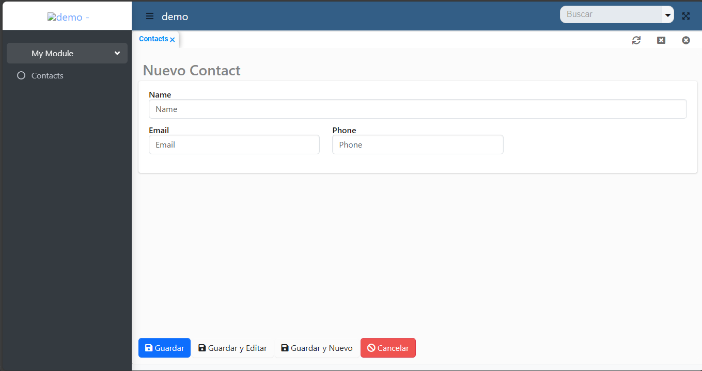

import {Aside} from '@astrojs/starlight/components';


## Installation

1. Create a new SpringBoot project using https://start.spring.io and select Web, JPA and a programing language for your Spring Boot app.
DynamiaTools is compatible with Java, Groovy and Kotlin

<Aside>You can [click
    here](https://start.spring.io/#!type=maven-project&language=java&packaging=jar&jvmVersion=21&groupId=com.example&artifactId=dynamia-tools-project&name=Dynaima&description=Demo%20project%20for%20Spring%20Boot&packageName=com.example.demo&dependencies=web,data-jpa,h2)
    to get a preconfigured Spring Boot project with Java, Maven and Web with JPA support.</Aside>

2. Download and import it in your IDE
3. Add DynamiaTools starter dependency.

**Maven**

```xml
<!--pom.xml-->
<dependencies>
    <dependency>
        <groupId>tools.dynamia</groupId>
        <artifactId>dynamia-tools-starter</artifactId>
        <version>LAST_VERSION</version>
    </dependency>
</dependencies>
```

**Gradle**
```groovy
//build.gradle
compile 'tools.dynamia:dynamia-tools-starter:LAST_VERSION'
```

Go to [Maven Central](https://central.sonatype.com/artifact/tools.dynamia/tools.dynamia.app) to check last version.

This starter enable DynamiaTools in your application and add support for ZK, JPA and custom views and routes.

4. Run and done

```java
//MyApplication.java

package demo;

import org.springframework.boot.SpringApplication;
import org.springframework.boot.autoconfigure.SpringBootApplication;

@SpringBootApplication
class MyApplication {

    public static void main(String[] args) {
        SpringApplication.run(MyApplication.class, args);
    }

}
```

After running the application, open your browser and go to http://localhost:8080. You should see a blank page with a
fully functional HTML template called Dynamical. Later will customize this page


## First project

Let's create something useful, like a contact CRUD to store our contact list. To create a CRUD in Dynamia Tools, follow these 3 steps:


1. Create a JPA entity
2. Create a Dynamia module
3. Define a view descriptor for **form** and **table** views

### 1. Create a JPA entity

Let's create a new class called `Contact` and annotated with `@Entity` to create a JPA entity. Add the fields name, email and
phone.

```java
//Contact.java
package demo;

import jakarta.persistence.Entity;
import jakarta.persistence.Table;
import jakarta.persistence.Id;
import jakarta.validation.constraints.NotNull;

import jakarta.persistence.*;
import jakarta.validation.constraints.Email;
import jakarta.validation.constraints.NotEmpty;

@Entity
@Table(name="contacts")
public class Contact {

    @Id
    @GeneratedValue(strategy = GenerationType.AUTO)
    private Long id;

    @NotEmpty
    private String name;
    @Email
    private String email;

    private String phone;

    public Long getId() {
        return id;
    }

    public void setId(Long id) {
        this.id = id;
    }

    public String getName() {
        return name;
    }

    public void setName(String name) {
        this.name = name;
    }

    public String getEmail() {
        return email;
    }

    public void setEmail(String email) {
        this.email = email;
    }

    public String getPhone() {
        return phone;
    }

    public void setPhone(String phone) {
        this.phone = phone;
    }

    @Override
    public String toString() {
        return name;
    }
}
```

This is a simple POJO class annotated with standard JPA annotations. Note that you can also use Validations annotation


## 2. DynamiaTools modules

DynamiaTools modules are standard Spring component classes that implement the `tools.dynamia.navigation.ModuleProvider`
interface and return a new `tools.dynamia.navigation.Module` object. Think of Dynamia modules as routers that define the navigation for pages.


```java
//ContactModuleProvider.java
package demo;

import org.springframework.stereotype.Component;
import tools.dynamia.crud.CrudPage;
import tools.dynamia.navigation.Module;
import tools.dynamia.navigation.ModuleProvider;

@Component
public class ContactModuleProvider implements ModuleProvider {

    @Override
    public Module getModule() {

        Module myModule = new Module("my-module", "My Module");
        myModule.addPage(new CrudPage("contacts", "Contacts", Contact.class));

        return myModule;
    }
}
```
`Modules` includes an ID, name, pages and pages groups. On the other hand the `Pages` include ID, name and path, which
in this case is represented by an entity Class. `IDs` are crucial because they define the path for your pages. For instance,
the `Contact` crud page has the path `/pages/my-module/contacts`.

## 3. View descriptors

View descriptors define how the views for entities will be renderer in runtime. By default, DynamiaTools render views for
Forms, Tables, Trees, Configs and others. In advanced guides you will learn how to customize view renderers and implement
your own Views types.

Descriptors are `YMLs` files with fields and parameters for entity classes. Lets create a folder for then in `/resources/META-INF/descriptors` a
nd create the file `ContactForm.yml`. The name of the file is not special but for good practice name it using the entity name and the view type.

```yaml
# /resources/META-INF/descriptors/ContactForm.yml
view: form # required
beanClass: demo.Contact # use fully qualified class name

fields:
  name:
    params: # customize component and layout
      span: 3
  email:
    params:
      type: email # setup type attribute of ZK textbox component
  phone:
    component: textbox #optional because string field are renderer link Textbox


#optional
layout:
  columns: 3

```

Now create a view descriptor for the table view `ContactTable.yml`

```yaml
# /resources/META-INF/descriptors/ContactTable.yml
view: table
beanClass: demo.Contact # use fully qualified class name

#all field are rendered like Labels because view type is table
fields:
  name:
  email:
  phone:
```

### 4. Run and enjoy

Now your app has a new menu called My Module and a submenu called Contacts. This is a fully functional CRUD with create,
read, update, delete and many more ready to use actions.

#### Table View


#### Form View


<Aside>Don’t be concerned about Spanglish labels in titles and actions, DynamiaTools and ZK have localized labels, and my browser is set to Spanish.</Aside>

### Customize your first project

Use standard Spring Boot `application.properties` or `application.yml` files to customize global settings for dynamia tools projects.
Use `dynamia.app` properties groups for dynamia tools.

```yaml
#application.yml
dynamia:
  app:
    name: My First Project
    short-name: MFP
    default-skin: Green
    default-logo: /static/logo.png
    default-icon: /static/icon.png # used when navigation bar is collapsed
    url: https://www.dynamia.tools

#other spring boot settings

```

Re-run your application and this time is beautiful app


**Responsive**


**Dynamical** is a Bootstrap 5 free template fully responsive, check https://github.com/dynamiatools/theme-dynamical for documentation


### Automatic REST

You’ve just built a full-stack project with DynamiaTools in about **10-15** minutes. Your project includes some special features,
one of which is an automatic RESTful endpoint for all `CrudPages`. Create some contacts in the front end, then replace the browser
URL with http://localhost:8080/api/my-module/contacts.

You should see a JSON response with your contacts. In my case, I received the following response:

```json
//http://localhost.com:8080/api/my-module/contacts
{
  "data" : [ {
    "id" : 1,
    "name" : "Peter Parker",
    "email" : "spidy@gmail.com",
    "phone" : "5556565656"
  }, {
    "id" : 2,
    "name" : "Dr Doom",
    "email" : "doomed@gmail.com",
    "phone" : "555-6999-666"
  }, {
    "id" : 3,
    "name" : "Tony Iron Stark",
    "email" : "ceo@starksindustry.com",
    "phone" : "5551656565"
  } ],
  "pageable" : {
    "totalSize" : 3,
    "pageSize" : 50,
    "firstResult" : 0,
    "page" : 1,
    "pagesNumber" : 1
  },
  "response" : "OK"
}
```

Then navigate to http://localhost.com:8080/api/my-module/contacts/1 and get info of contact with ID = 1

```json
{
    "data": {
        "id": 1,
        "name": "Peter Parker",
        "email": "spidy@gmail.com",
        "phone": "5556565656"
    },
    "response": "OK"
}
```

Check that DynamiaTool default json form has this form:

```json
{
  "data": [],
  "response": "",
  "pageable": {}
}
```


## Congratulations

With this **Getting Started** guide, you’ve just built a web application with automatic CRUD support, automatic RESTful endpoints,
and a responsive template. Continue with the following guides to learn advanced topics with DynamiaTools.

